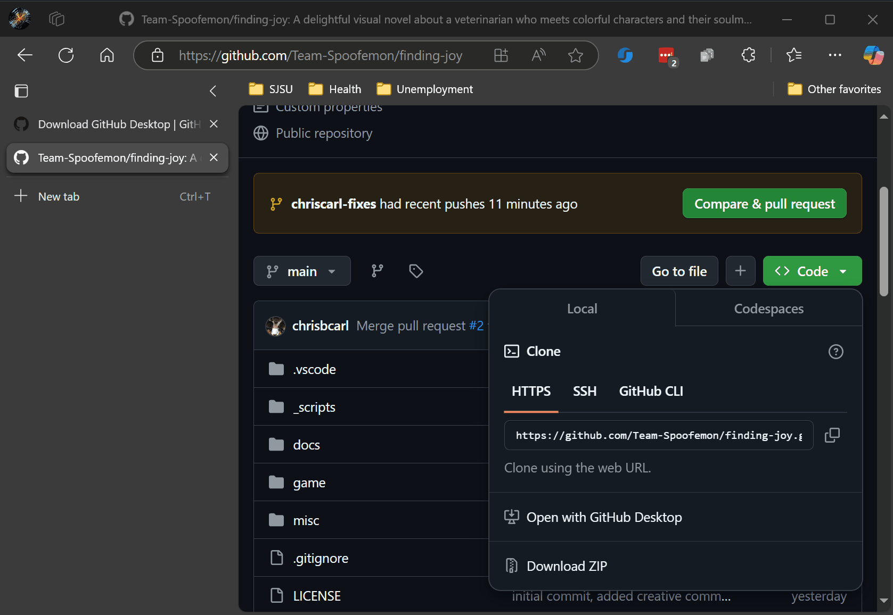
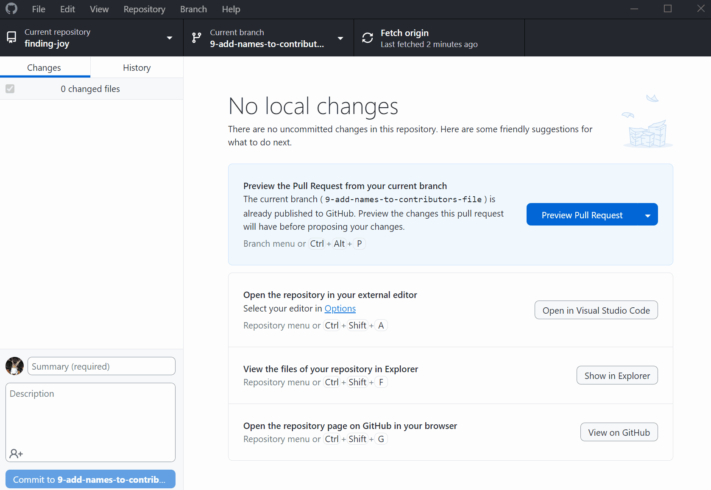
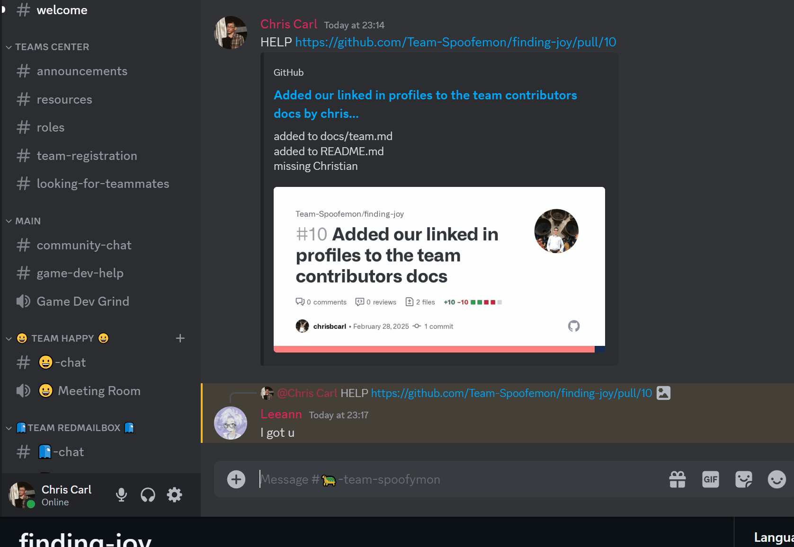
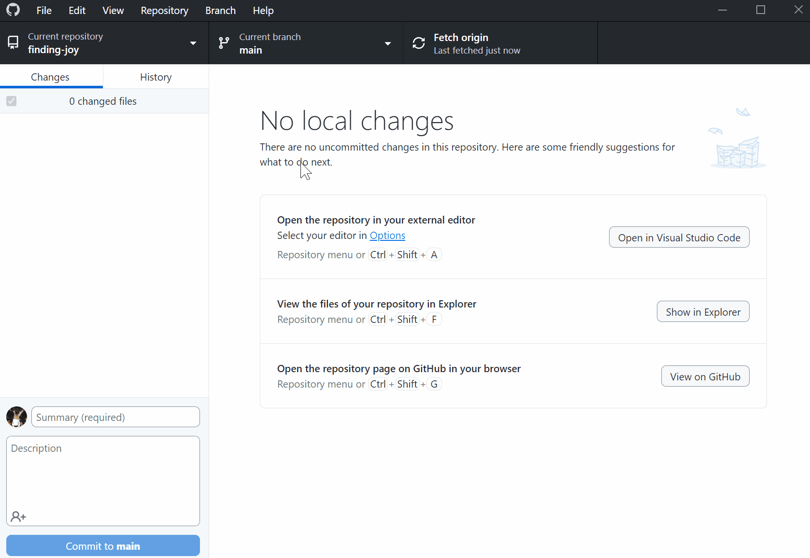

# Git Guide

## Setup
1. Download [Git Desktop](https://desktop.github.com/download/)
2. Clone the repository with url `https://github.com/Team-Spoofemon/finding-joy`

## Development Loop
For every issue, do the steps 1-5 until there are no issues remaining:
1. Either create a new issue, or pick one that exists in the list
    - in github website
        - add a good title
        - add a good description
        - assign someone to finish the issue
        - label the issue
        - give the issue a milestone
        - development > "Create a branch"
    - in github desktop
        - fetch origin
        - switch to the recently made branch

    
2. Make your edits
    - in `VS Code` or another editor
        - change your files, save your files
    - in github desktop
        - add a summary
        - add extra descriptions
        - commit
        - push origin

    

3. Pull request
    - in github website
        - go to the repository
        - compare and pull request
        - add some text if youd like
        - create
        - add a reviewer, either a single person or a whole team
    - message someone to approve it

    

4. Merge after changes are approved
    - in github website
        - merge pull request
        - add any other descriptive text you'd like
    - have a look at the changes in the `main` branch

    

5. Clean up locally
    - in github desktop
        - fetch origin
        - branch > delete
    - have a look at the changes locally

    